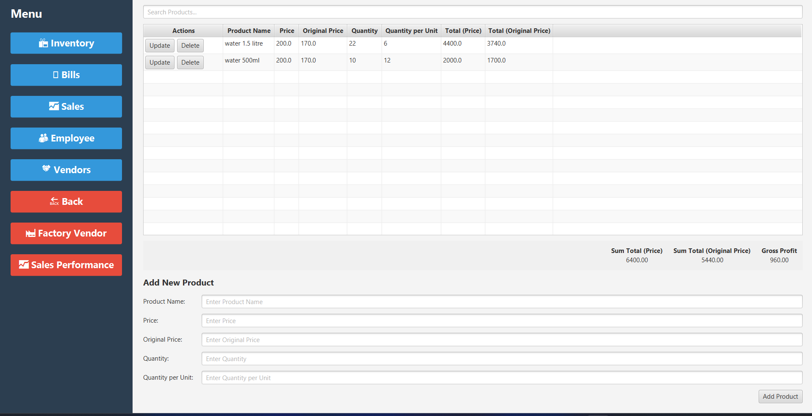
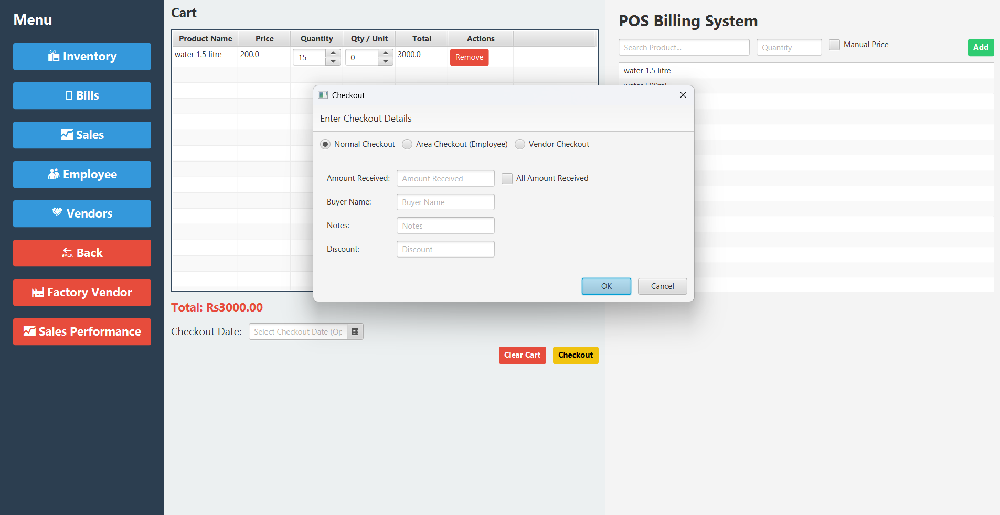
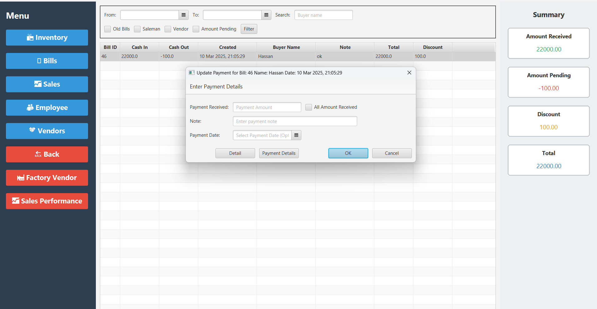
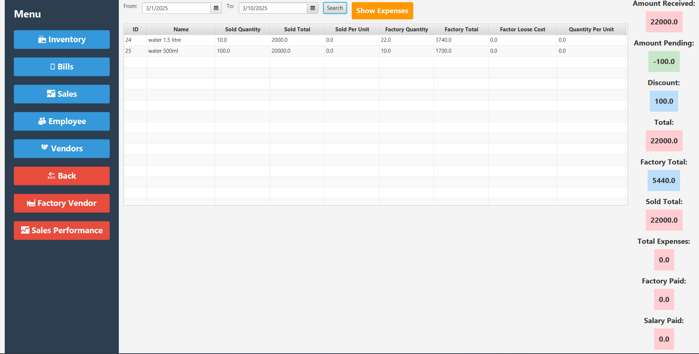

# POS System

This project is a robust, real-time Point-Of-Sale (POS) system built using Java, JavaFX, and Firebird SQL. It features an intuitive user interface with customizable checkout modes, efficient inventory management, and comprehensive sales reporting. The system is designed to streamline retail operations by providing multiple payment options, keyboard shortcuts for faster transactions, and dynamic data management.

## Features

- **Multi-Mode Checkout:**  
  Supports Normal, Area (Employee), and Vendor checkout modes with custom fields and dialogs for different payment scenarios.
- **Real-Time Inventory & Sales Management:**  
  Add products to the cart, update quantities via keyboard shortcuts (e.g., arrow keys, space bar to increment by 10), and generate bills instantly.
- **Flexible Payment Handling:**  
  Update payments with detailed dialogs, store payment records, and generate receipts.
- **Comprehensive Reporting:**  
  Automatically aggregates totals such as Amount Received, Amount Pending, Discount, Total, and more from multiple tables.
- **User-Friendly Interface:**  
  Custom UI components, editable table cells, and keyboard shortcuts enhance efficiency and ease of use.

## Screenshots

Below are some screenshots of the application in action:






## Installation

1. **Clone the repository:**
   ```bash
   git clone https://github.com/yourusername/pos-system.git
